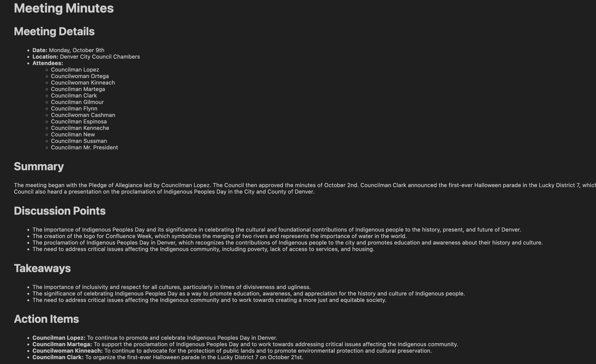

# 🗣️📋 EchoMinutes

**EchoMinutes** is an AI-powered tool that transcribes and summarizes audio recordings from city council and public meetings into structured, readable meeting minutes. It uses OpenAI Whisper for transcription and a quantized LLM (Phi-3 or LLaMA) for summarization.

🪪 The name EchoMinutes reflects the idea of "echoing" the spoken word into official written records.

## ✨ Features

### 🎙️ Audio Transcription
- Uses OpenAI Whisper to convert `.mp3` and `.wav` audio files into accurate text.

### 🧠 Summarization with LLMs
- Transcripts are summarized into clean, structured meeting minutes in Markdown.
- Includes summaries, discussion points, takeaways, and action items with owners.

### 🧮 Efficient 4-bit LLM Inference
- Uses BitsAndBytes 4-bit quantization to run powerful models with less GPU.
- Supports LLaMA 3.1 and Phi-3 Mini.

### 📓 Notebook Interface
- Full Jupyter/Colab notebook available: `EchoMinutes_Demo.ipynb`
- Runs the entire pipeline end-to-end with visual Markdown output.

## 📂 Project Structure

```
EchoMinutes/
├── app.py                   # Optional Gradio UI (not required)
├── config.py                # Constants and model names
├── echo_minutes.py          # Transcribe + summarize logic
├── EchoMinutes_Demo.ipynb   # ✅ Full notebook pipeline
├── requirements.txt         # Pip dependencies
├── sample_audio/            # Example meeting audio files
└── README.md
```

## 🚀 Getting Started

### 1. Clone the Repo
```bash
git clone https://github.com/amirgadami/EchoMinutes.git
cd EchoMinutes
```

### 2. Set Up the Environment
```bash
conda env create -f echo_minutes.yml
conda activate echo_minutes
```

### 3. Add API Keys
Create a `.env` file or set environment variables:
```bash
OPENAI_API_KEY=your_openai_key
HF_TOKEN=your_huggingface_token
```

### 4. Run the Notebook
```bash
jupyter notebook EchoMinutes_Demo.ipynb
```

## 📋 Sample Output




## 🤝 Contributing

Contributions welcome! Some ideas to explore:

- 🗣️ Speaker attribution via diarization
- ⏱️ Timestamped action item extraction
- 🔁 Support YouTube or live-streamed audio
- 🧾 Export minutes to PDF or DOCX

## 📢 Contact

Made with ❤️ by Amir Ghadami

📧 Email: ah.ghadami75@gmail.com  
🔗 LinkedIn: [Amirhossein Ghadami](https://www.linkedin.com/in/amirhosseinghadami/)  
🕊️ Twitter (X): [@Amir_ghadamii](https://x.com/Amir_ghadamii)

## 🧪 License

This project is licensed under the MIT License. See the LICENSE file for more info.
